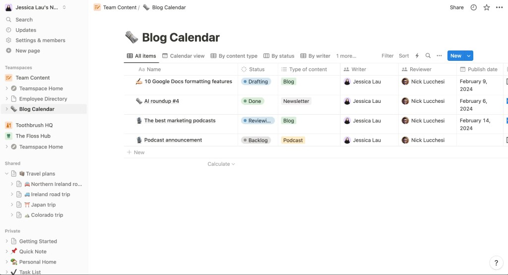
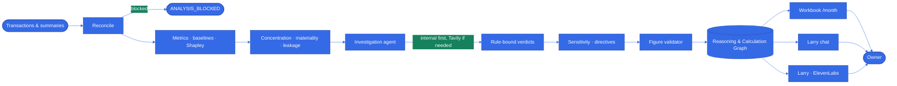
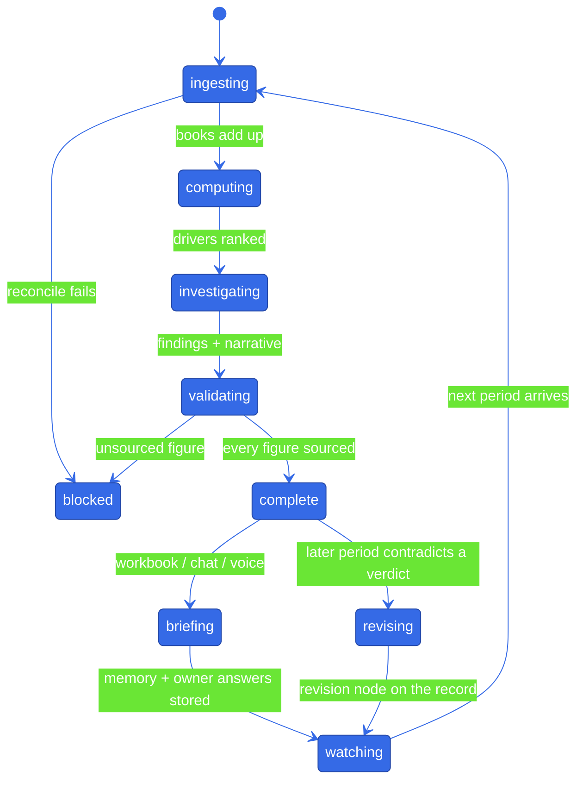

<div align="center">

# Larry

**The analyst that already did the month — a proactive financial companion that attributes every dollar, investigates why, and holds one verified thread across the workbook, chat, and voice.**

[](https://www.python.org)
[](https://kit.svelte.dev)
[](https://elevenlabs.io)
[](https://openai.com)
[](https://duckdb.org)

<br />



</div>

Today, a café owner closes the month by becoming their own CFO. POS totals, supplier invoices, and a spreadsheet sit in different places. Revenue can be up while profit is down, and the owner is left reconciling the story by hand. The industry calls it "looking at the numbers." We think that's the problem.

Larry is an autonomous financial-analysis agent that takes the attribution job off the owner's hands. Spreadsheets organise around totals, but the danger lives between the lines. When Garden State Coffee sells more iced drinks, tickets look healthy and sales rise — but the mix is thinner, milk and beans concentrate the hit, and electricity can look like the villain because it moved the most in percent. A single-line P&L would tell the owner to chase volume. That is the opposite of what they need. No one is watching the whole picture. They are.

Larry watches it instead. It holds one model of the business — a driver graph whose profit change sums exactly — and lives where the owner already works: a workbook they can read, a chat they can ask, a voice briefing they can take on the floor. It reaches the causes first, names the counterparties and SKUs that concentrated the dollars, and asks the two or three questions that would close the largest unexplained gaps. And when a later month contradicts an earlier explanation, it revises itself on the record.

It never invents a figure. It computes, investigates, and cites.

Because the month does not explain itself when the spreadsheet closes. Neither should the analyst.

Larry is the analyst that already did the month.

## See it locally

Start the API on `8090` and the UI on `5173`. The workbook loads the newest completed run.

| Workbook | Audit trail |
| --- | --- |
| [`/month`](http://localhost:5173/month) | [`/audit`](http://localhost:5173/audit) |

Related surfaces: [`/today`](http://localhost:5173/today) · [`/capture`](http://localhost:5173/capture) · [`/queue`](http://localhost:5173/queue) · [`/sandbox`](http://localhost:5173/sandbox) · [`/ask`](http://localhost:5173/ask)

## What it does

- Ingests a period of transactions, reconciles them against the accounting summary, and **blocks** analysis when the books do not add up.
- Attributes every dollar of operating-profit change to business drivers with an exact-sum Shapley decomposition — mix is a first-class leaf, not a residual bucket.
- Names the counterparties, SKUs, and line items concentrating that impact, then ranks what is material in dollars, not percentages.
- Scores anomalies against the café's own history (median / MAD, shrunk toward sector priors on month one).
- Flags spend that has moved beyond what the market explains — phrased as verification, never accusation.
- Investigates with hypothesis templates, internal evidence first, optional Tavily when a live hypothesis needs an outside check, then issues a rule-bound verdict.
- Simulates candidate actions through the same driver graph and ranks them by modeled contribution, with assumptions attached.
- Asks the owner the questions whose answers would close the largest unexplained dollar gaps, and revises earlier explanations when a later period contradicts them.
- Delivers all of that through one verified state: the workbook, the audit graph, chat, and Larry's ElevenLabs voice.

## How it works

One rule runs everything: the engine computes, the model reasons, deterministic code decides. The LLM can recommend caution and write prose; it cannot invent a figure, loosen a reconciliation block, or override a red-flag verdict. Chat and voice are only surfaces. The analysis lives once, in the reasoning and calculation graph.



The deciding is done by four parts:

| Part | What it does | Status |
| --- | --- | --- |
| Deterministic engine | Ingest, reconcile, metrics, robust baselines, exact-sum Shapley, concentration, materiality, leakage, sensitivity, directives | Built |
| Reasoning & calculation graph | Persistent DuckDB nodes and edges; every figure and claim is a node with provenance | Built |
| Investigation agent | Template hypotheses, belief update with a temporal cap, verdict rules, owner questions, cross-period revision, optional Tavily | Built |
| Surfaces | SvelteKit workbook + audit trail; `/chat` grounded in the run; ElevenLabs voice that only sequences validated text | Built |

Guiding principle, from the PRD: **computed facts first, agent intelligence second, voice last.**

## Analysis lifecycle



Demo business: **Garden State Coffee** — an independent café on a GLP-1 of its own kind: month-over-month volume, price, mix, and input costs. The shipped demo is August 2026 (scenario B: iced-drink mix shift — revenue up, profit down). Scenario A–P live under `backend/eval/scenarios.py` for the regression matrix.

## Run it

```bash
python3 -m venv .venv
.venv/bin/pip install -r backend/requirements.txt
cp backend/.env.example backend/.env   # fill secrets locally

.venv/bin/python backend/run.py --scenario B --run-id demo_b --no-llm
.venv/bin/uvicorn --app-dir backend voice.server_tools:app --port 8090
```

In a second terminal:

```bash
cd ui
npm install
npm run dev                      # http://localhost:5173  →  redirects to /month
```

Vite proxies `/api` to `http://127.0.0.1:8090`. Set `PUBLIC_API_BASE_URL` only when the API is hosted elsewhere. OpenAI, ElevenLabs, Tavily, and PRISM credentials stay in `backend/.env` — never in `PUBLIC_*` variables or frontend source.

Without `--llm`, a run is deterministic and makes no model calls. Add `--llm` to use Astra for classification and narrative. Add `--research --research-context context.json` to permit at most four template-bound Tavily searches.

```bash
.venv/bin/python -m pytest backend
.venv/bin/python -m pytest -c backend/pytest.ini -m regression
```

### Secrets

```bash
# backend/.env
OPENAI_API_KEY=
OPENAI_MODEL=gpt-6-astra
OPENAI_CLASSIFIER_MODEL=gpt-6-astra
OPENAI_JUDGMENT_MODEL=gpt-6-astra

PRISMTRACE_API_KEY=
PRISMTRACE_PROJECT_ID=
PRISMTRACE_HOST=https://prism-api-prod.up.railway.app

TAVILY_API_KEY=                  # optional; required only with --research

ELEVENLABS_API_KEY=
ELEVENLABS_AGENT_ID=
ELEVENLABS_WEBHOOK_SECRET=       # required for the post-call webhook

BUSINESS_NAME=Garden State Coffee
FRONTEND_ORIGINS=http://localhost:3000,http://localhost:5173
```

A live voice conversation needs both `ELEVENLABS_API_KEY` and `ELEVENLABS_AGENT_ID`. Deploy or update that agent only after the FastAPI service has a public HTTPS URL — ElevenLabs cannot reach `localhost`:

```bash
.venv/bin/python backend/voice/deploy_agent.py --base-url https://api.example.com
```

### Smoke the demo

```bash
.venv/bin/python backend/run.py --scenario B --run-id demo_b --no-llm

curl http://127.0.0.1:8090/health
curl http://127.0.0.1:8090/runs | jq
curl http://127.0.0.1:8090/dashboard/demo_b | jq '.report.headline, .attribution_summary'
curl http://127.0.0.1:8090/runs/demo_b/graph | jq '.nodes | length'
```

Then open `http://localhost:5173/month`. Ask Larry (dock or `/ask`) a question about profit; the cited workbook rows should highlight.

Generate and analyze seeded transaction files instead of a canned scenario:

```bash
PYTHONPATH=backend .venv/bin/python -m eval.generator \
  backend/data/scenarios/b_product_mix.yaml --out /tmp/generated-b --seed 7
.venv/bin/python backend/run.py --data /tmp/generated-b --period 2026-08 --run-id generated_b --no-llm
```

## Project layout

```
backend/
├── run.py                 CLI: ingest → analyze → persist → PRISM
├── prism_setup.py         PRISM session + run submission
├── engine/                Deterministic arithmetic
│   ├── ingest.py            CSV → canonical transactions
│   ├── reconcile.py         Cash/accrual window; ANALYSIS_BLOCKED
│   ├── graph_def.py         Café driver graph + profit_fn
│   ├── metrics.py           Period metrics
│   ├── baselines.py         Median / MAD + sector-prior shrinkage
│   ├── shapley.py           Exact-sum attribution
│   ├── concentration.py     Counterparties / SKUs / lines
│   ├── materiality.py       Dollar ranking, not percentages
│   ├── leakage.py           Verification flags (never accusations)
│   ├── relationships.py     Broken metric-relationship rules
│   ├── sensitivity.py       Action simulation + elasticity sweep
│   ├── directives.py        Next-period targets
│   └── demo_states.py       Garden State Coffee canned leaves
├── rcg/
│   ├── store.py             DuckDB nodes / edges
│   ├── invariants.py        Sum-check and graph laws
│   └── validator.py         Every spoken/written figure must match a node
├── agent/
│   ├── investigate.py       Hypothesis protocol
│   ├── templates.py         Per-leaf hypothesis classes
│   ├── belief.py            Likelihood ratios + temporal cap
│   ├── verdict.py           Rule-bound decide()
│   ├── questions.py         Value-of-information questions
│   ├── memory.py            Cross-period carry-forward
│   ├── revision.py          On-the-record mind-changing
│   ├── narrative.py         Validated prose
│   ├── llm.py               OpenAI Astra (classifier / judgment)
│   └── tavily_tool.py       Template-bound web research
├── voice/
│   ├── server_tools.py      FastAPI: /runs, /dashboard, /chat, /voice, /tools/*
│   ├── agent_config.json    ElevenLabs agent prompt
│   ├── tool_specs.py        Webhook tool schemas
│   ├── deploy_agent.py      Push agent + tools to ElevenLabs
│   └── postcall.py          Transcript + confirmation candidates
├── eval/                    Scenario generator + A–P regression matrix
├── data/                    Category map + scenario YAML
└── tests/
ui/                        SvelteKit workbook (Larry desktop UI)
docs/PRD.md                Full product + engine spec
AGENTS.md                  PRISM wiring rule for new model entry points
```

## Stack

- Python, DuckDB, FastAPI, Uvicorn
- OpenAI structured outputs (`gpt-6-astra`) for classification, judgment, and chat — never for arithmetic
- SvelteKit + Vite workbook UI (desktop-first; `/api` proxied to FastAPI)
- ElevenLabs Agents for live voice (server tools return pre-rendered, validated sentences; the voice model sequences, it does not compute)
- Tavily for bounded, template-only external research
- PRISM for traces (`PRISMTRACE_*`) — every new model, tool, or graph entry point must be wired before merge

## Human setup checklist

### Engine + API

1. Create `.venv`, install `backend/requirements.txt`, copy `backend/.env.example`.
2. Run a deterministic scenario (`--no-llm`) so `backend/runs/demo_b.json` and `backend/runs/rcg.duckdb` exist before you open the UI.
3. Start FastAPI on `8090`, then `npm run dev` in `ui/`.
4. `curl /health` and `/runs` before debugging the workbook.

### Larry (chat + voice)

1. Chat works without ElevenLabs: `/chat` answers from the validated run (deterministic fallback if Astra is unset).
2. Voice needs a deployed ElevenLabs agent whose webhook tools point at a public HTTPS `/tools/*`.
3. In the agent prompt, keep the rule the Worker already enforces: every figure comes from the latest tool result. Dynamic variables set at session start:

   | Variable | What it is |
   | --- | --- |
   | `{{business_name}}` | Owner-facing name (`BUSINESS_NAME`, default Garden State Coffee) |
   | `{{period}}` | Period under analysis (`2026-08`) |
   | `{{headline_text}}` | Pre-rendered briefing — first spoken line |
   | `{{finding_count}}` | How many material findings |
   | `{{top_finding_title}}` | Lead finding |
   | `{{run_id}}` | Routing id (not spoken aloud) |

4. Post-call webhook → `https://<api>/webhooks/elevenlabs/post-call` with `ELEVENLABS_WEBHOOK_SECRET`.
5. Browser session is minted by `GET /voice/session?run_id=...` so the ElevenLabs API key never leaves the server.

### PRISM

`AGENTS.md` is the standing rule: if you add or change an agent, chain, graph, tool, retriever, or any entry point that calls a model, wire it to PRISM before you finish. Unwired code is invisible in the dashboard.

Full engine, investigation, voice, and eval design lives in [`docs/PRD.md`](./docs/PRD.md).

---

<div align="center">

The owner was never meant to be the attribution layer.

</div>
